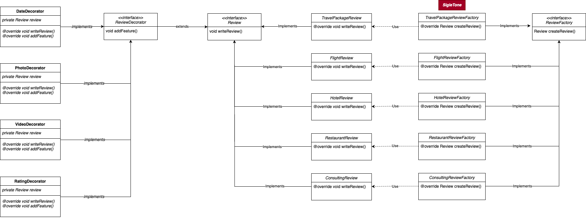

### 리뷰 및 평가 서비스
#### 패턴 선택 근거
- 생성 디자인 패턴: `팩토리 패턴`, `싱글톤 패턴`
- 선택 이유: 팩토리 메서드 패턴은 객체 생성을 서브 클래스에게 위임하여 객체 생성 과정을 캡슐화하는 패턴입니다. 저희 'JourneyBuddy'에서의 리뷰 및 평가 서비스는 여러 유형의 리뷰나 평가를 생성해야 합니다. 팩토리 패턴을 활용하면 서브 클래스에서 실제로 어떤 유형의 리뷰나 평가를 생성할 지 결정할 수 있으며, 이는 유연성과 확장성을 제공하기 때문에 저희 서비스의 리뷰 및 평가에서 적합하다고 판단하였습니다. 또한 팩토리 클래스들을 Spring boot에서 자바 빈(Bean)으로 관리함으로써 싱글톤 패턴또한 적용하여 불필요한 메모리 누수를 방지하도록 설계하였습니다. 

- 구조 디자인 패턴: `데코레이터 패턴`
- 선택 이유: 데코레이터 패턴은 객체의 추가적인 기능을 동적으로 확장할 수 있는 패턴입니다. 여행 리뷰 및 평가 서비스에서는 리뷰 및 평가 객체에 다양한 속성을(사진, 평점, 영상...) 추가해야 합니다. 데코레이터 패턴을 사용하면 이러한 요소들을 유연하게 확장할 수 있기 때문에 기존의 리뷰나 평가 객체를 수정하지 않고도 새로운 기능을 추가할 수 있으므로 코드의 변경을 최소화할 수 있다고 판단하여 데코레이터 패턴을 추가하였습니다.

#### 클래스 다이어그램



#### 파일별 모듈 코드

```java
//Review.java
package greenlight.jejunu.journeybuddy.review.domain;  
  
public interface Review {  
    void writeReview();  
}
```

```java
//TravelReview.java
package greenlight.jejunu.journeybuddy.review.domain;  
  
public class TravelReview implements Review{  
    @Override  
    public void writeReview(){  
        System.out.println("여행 리뷰 작성");  
    }  
}
```

```java
//FlightReview.java
package greenlight.jejunu.journeybuddy.review.domain;  
  
public class FlightReview implements Review {  
    @Override  
    public void writeReview() {  
        System.out.println("항공 리뷰 작성");  
    }  
}
```

```java
//HotelReview.java
package greenlight.jejunu.journeybuddy.review.domain;  
  
public class HotelReview implements Review {  
    @Override  
    public void writeReview() {  
        System.out.println("숙박 리뷰 작성");  
    }  
}
```

```java
//RestaurantReview.java
package greenlight.jejunu.journeybuddy.review.domain;  
  
public class RestaurantReview implements Review {  
    @Override  
    public void writeReview() {  
        System.out.println("음식점 리뷰 작성");  
    }  
}
```

```java
//ConsultingReview.java
package greenlight.jejunu.journeybuddy.review.domain;  
  
public class ConsultingReview implements Review {  
    @Override  
    public void writeReview() {  
        System.out.println("상담 리뷰 작성");  
    }  
}
```

```java
//ReviewFactory.java
package greenlight.jejunu.journeybuddy.review.factory;  
  
import greenlight.jejunu.journeybuddy.review.domain.Review;  
import org.springframework.stereotype.Component;  
  
@Component  
public interface ReviewFactory {  
    Review createReview();  
}```

```java
//TravelReviewFactory.java
package greenlight.jejunu.journeybuddy.review.factory;  
  
import greenlight.jejunu.journeybuddy.review.domain.Review;  
import greenlight.jejunu.journeybuddy.review.domain.TravelReview;  
  
  
public class TravelReviewFactory implements ReviewFactory {  
    @Override  
    public Review createReview() {  
        return new TravelReview();  
    }  
}
```

```java
//FlightReviewFactory.java
package greenlight.jejunu.journeybuddy.review.factory;  
  
import greenlight.jejunu.journeybuddy.review.domain.FlightReview;  
import greenlight.jejunu.journeybuddy.review.domain.Review;  
  
public class FlightReviewFactory implements ReviewFactory {  
    @Override  
    public Review createReview() {  
        return new FlightReview();  
    }  
}
```

```java
//HotelReviewFactory.java
package greenlight.jejunu.journeybuddy.review.factory;  
  
import greenlight.jejunu.journeybuddy.review.domain.HotelReview;  
import greenlight.jejunu.journeybuddy.review.domain.Review;  
  
public class HotelReviewFactory implements ReviewFactory {  
    @Override  
    public Review createReview() {  
        return new HotelReview();  
    }  
}
```

```java
//RestaurantReviewFactory.java
package greenlight.jejunu.journeybuddy.review.factory;  
  
import greenlight.jejunu.journeybuddy.review.domain.RestaurantReview;  
import greenlight.jejunu.journeybuddy.review.domain.Review;  
  
public class RestaurantReviewFactory implements ReviewFactory {  
    @Override  
    public Review createReview() {  
        return new RestaurantReview();  
    }  
}
```

```java
//ConsultingReviewFactory.java
package greenlight.jejunu.journeybuddy.review.factory;  
  
import greenlight.jejunu.journeybuddy.review.domain.ConsultingReview;  
import greenlight.jejunu.journeybuddy.review.domain.Review;  
  
  
public class ConsultingReviewFactory implements ReviewFactory {  
    @Override  
    public Review createReview() {  
        return new ConsultingReview();  
    }  
}
```

```java
//ReviewDecorator.java
package greenlight.jejunu.journeybuddy.review.decorator;  
  
import greenlight.jejunu.journeybuddy.review.domain.Review;  
import org.springframework.stereotype.Component;  
  
@Component  
public interface ReviewDecorator extends Review {  
    Review addFeature(Review review);  
}
```

```java
//DateDecorator.java
package greenlight.jejunu.journeybuddy.review.decorator;  
  
import greenlight.jejunu.journeybuddy.review.domain.Review;  
  
public class DateDecorator implements ReviewDecorator {  
    private Review review;  
  
    public DateDecorator(Review review) {  
        this.review = review;  
    }  
  
    @Override  
    public void writeReview() {  
        review.writeReview();  
    }  
  
    @Override  
    public Review addFeature(Review review) {  
        System.out.println("날짜 선택 기능 추가");  
        this.review = review;  
        return review;  
    }  
}
```

```java
//PhotoDecorator.java
package greenlight.jejunu.journeybuddy.review.decorator;  
  
import greenlight.jejunu.journeybuddy.review.domain.Review;  
  
public class PhotoDecorator implements ReviewDecorator {  
    private Review review;  
  
    public PhotoDecorator(Review review) {  
        this.review = review;  
    }  
  
    @Override  
    public void writeReview() {  
        review.writeReview();  
    }  
  
    @Override  
    public Review addFeature(Review review) {  
        System.out.println("사진 첨부 기능 추가");  
        this.review = review;  
        return review;  
    }  
}
```

```java
//VideoDecorator.java
package greenlight.jejunu.journeybuddy.review.decorator;  
  
import greenlight.jejunu.journeybuddy.review.domain.Review;  
  
public class VideoDecorator implements ReviewDecorator {  
    private Review review;  
  
    public VideoDecorator(Review review) {  
        this.review = review;  
    }  
  
    @Override  
    public void writeReview() {  
        review.writeReview();  
    }  
  
    @Override  
    public Review addFeature(Review review) {  
        System.out.println("영상 첨부 기능 추가");  
        this.review = review;  
        return review;  
    }  
}
```

```java
//RatingDecorator.java
package greenlight.jejunu.journeybuddy.review.decorator;  
  
import greenlight.jejunu.journeybuddy.review.domain.Review;  
  
public class RatingDecorator implements ReviewDecorator {  
    private Review review;  
  
    public RatingDecorator(Review review) {  
        this.review = review;  
    }  
  
    @Override  
    public void writeReview() {  
        review.writeReview();  
    }  
  
    @Override  
    public Review addFeature(Review review) {  
        System.out.println("평점 부여 기능 추가");  
        this.review = review;  
        return review;  
    }  
}
```

```java
//ReviewService.java -> 패턴이 적용된 코드 사용예시
package greenlight.jejunu.journeybuddy.review;  
  
import greenlight.jejunu.journeybuddy.review.decorator.ReviewDecorator;  
import greenlight.jejunu.journeybuddy.review.domain.Review;  
import greenlight.jejunu.journeybuddy.review.factory.ReviewFactory;  
import org.springframework.stereotype.Service;  
  
@Service  
public class ReviewService{  
    private Review review;  
  
    public ReviewService(ReviewFactory rf, ReviewDecorator rd){  
        this.review = rf.createReview();  
        this.review = rd.addFeature(review);  
    }  
  
    public void writeReviewWithPhoto(){  
        review.writeReview();  
    }  
}
```

